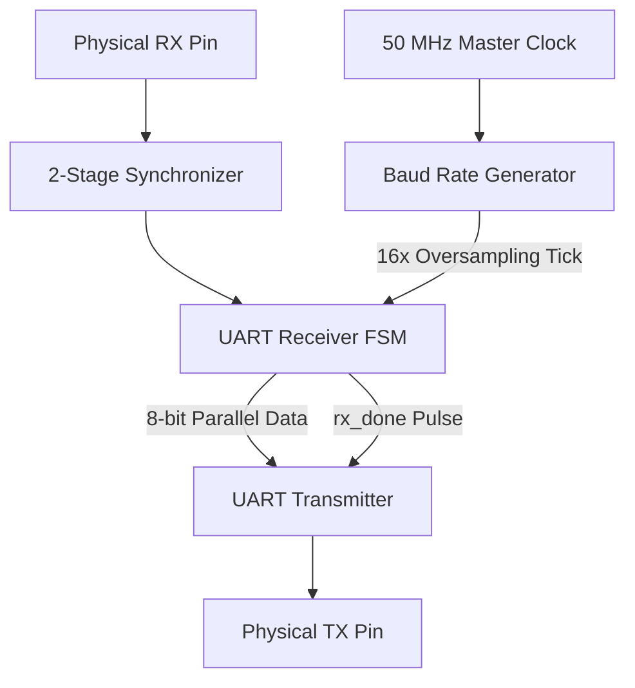

# Synthesis-Ready UART Echo System (RTL Design)

A fully synthesizable **UART Receiver and Transmitter system** designed in **Verilog HDL**, demonstrating fundamental RTL design concepts used in digital VLSI systems.

This project implements a complete asynchronous serial communication pipeline where incoming UART data is received, processed synchronously, and transmitted back automatically through a hardware loopback mechanism.

The design focuses on:

- RTL architecture development
- Asynchronous signal synchronization
- Baud-rate generation
- FSM-based UART communication
- Hardware verification
- FPGA synthesis using Xilinx Vivado

---

# 📌 Project Overview

UART (Universal Asynchronous Receiver Transmitter) is a widely used serial communication protocol that enables data transfer between digital systems without requiring a shared clock.

This project implements:

- A **UART Receiver (RX)** capable of sampling asynchronous serial data
- A **UART Transmitter (TX)** capable of generating UART frames
- A **Top-Level Echo Module** that automatically returns received data back to the sender

### System Flow

```
Host → UART RX → Parallel Data Processing → UART TX → Host
```

The complete design is optimized for FPGA implementation and verified through simulation and synthesis.

---

# 🛠️ Technology Stack

| Category | Tools / Specifications |
|----------|------------------------|
| Hardware Description Language | Verilog HDL (IEEE 1364) |
| FPGA Development Tool | AMD Xilinx Vivado ML Standard |
| Target FPGA | Xilinx Artix-7 (xc7a35tcpg236-1) |
| Clock Frequency | 50 MHz |
| Communication Protocol | UART |
| Baud Rate | 9600 bps |
| Design Style | RTL Design |
| Verification | Behavioral Simulation |

---

# ✨ Key Features

- ✅ Fully synthesizable Verilog RTL design
- ✅ Modular UART RX and TX architecture
- ✅ 16× oversampling-based UART reception
- ✅ 2-stage synchronizer for metastability protection
- ✅ FSM-controlled communication logic
- ✅ LSB-first UART data transmission
- ✅ Automated hardware loopback (Echo Functionality)
- ✅ Verified through simulation and FPGA synthesis

---

# 🏗️ Hardware Architecture

The design consists of four major blocks:

1. Input Synchronization
2. Baud Rate Generation
3. UART Receiver FSM
4. UART Transmitter FSM


## Block Diagram



---

# ⚙️ Module Description

## 1. Baud Rate Generator (16× Oversampling)

UART communication does not use a shared clock between transmitter and receiver. Therefore, accurate sampling of incoming bits is required.

The receiver uses a **16× oversampling clock** to identify the center point of each received bit.

### Configuration

System Clock:

\[
F_{clk}=50MHz
\]


Required Oversampling Frequency:

\[
F_{tick}=9600 \times 16
\]


\[
F_{tick}=153.6kHz
\]


Counter Calculation:

\[
Counter=\frac{50MHz}{153.6kHz}
\]


\[
Counter \approx 325.52
\]


The baud generator counts:

```
0 → 325
```

before generating the next sampling tick.

This provides accurate UART timing and improves noise immunity during reception.

---

# 2. Metastability Synchronizer

The UART RX input is asynchronous with respect to the FPGA system clock.

Directly sampling this signal may cause metastability inside FPGA flip-flops.

To prevent this, a two-stage synchronizer is implemented:

```
RX Input
   |
   ↓
Flip-Flop 1
   |
   ↓
Flip-Flop 2
   |
   ↓
Receiver FSM
```

The first flip-flop captures the asynchronous signal, while the second provides a stable signal for synchronous processing.

---

# 3. UART Receiver (RX) FSM

The receiver is controlled using a four-state Finite State Machine:

| State | Function |
|-------|----------|
| IDLE | Waits for incoming UART frame |
| START | Detects start bit |
| DATA | Samples 8-bit payload |
| STOP | Validates stop bit |

### Reception Process

1. Detect falling edge on RX line
2. Wait for midpoint of start bit
3. Sample each data bit using 16× clock ticks
4. Shift bits into an 8-bit register
5. Generate `rx_done` pulse after successful reception


UART Frame Format:

```
Start Bit | 8 Data Bits | Stop Bit

    0     |    D0-D7    |    1
```

---

# 4. UART Transmitter (TX)

The transmitter converts parallel data into a serial UART frame.

The TX module operates at the standard baud rate.

Calculation:

\[
Counter=\frac{50MHz}{9600}
\]


\[
Counter=5208.33
\]


Therefore:

```
5208 clock cycles = 1 UART bit period
```

### Transmission Sequence

When `tx_start` is asserted:

1. Load 8-bit data into shift register
2. Send Start Bit (`0`)
3. Transmit data bits LSB first
4. Send Stop Bit (`1`)
5. Return to idle state

---

# 🔄 Top-Level Loopback Module

The `uart_top_echo` module integrates the complete system.

Data flow:

```
RX Pin
  |
  ↓
UART Receiver
  |
  ↓
rx_data[7:0]
  |
  ↓
UART Transmitter
  |
  ↓
TX Pin
```

The receiver completion signal:

```
rx_done → tx_start
```

directly triggers transmission.

This creates a **zero-latency hardware UART echo system**.

---

# 🔬 Verification & Simulation

The design was verified using a custom behavioral testbench:

```
tb_uart_top_echo.v
```

## Test Scenario

The testbench simulates:

- Host transmitting character:

```
ASCII Character : 'B'
Hex Value       : 0x42
Binary           : 01000010
```

- FPGA receiving the UART frame
- Automatic retransmission through TX
- Monitoring the returned serial waveform


## Simulation Result


The waveform confirms:

- Correct UART frame detection
- Proper RX sampling
- Successful data recovery
- Automatic TX echo generation

---

# 🧩 RTL Synthesis Results

The design was synthesized using:

**AMD Xilinx Vivado ML Standard**

Target Device:

```
xc7a35tcpg236-1
```

The RTL design was successfully mapped into FPGA hardware resources:

- LUTs for combinational logic
- Flip-flops for sequential logic
- FSM transition logic
- Baud rate counters
- Synchronizer registers

No unintended latches were generated.


## Vivado Synthesis Schematic


---

# 📂 Project Structure

```
UART-Echo-System/
│
├── rtl/
│   ├── uart_rx.v
│   ├── uart_tx.v
│   ├── baud_generator.v
│   ├── synchronizer.v
│   └── uart_top_echo.v
│
├── simulation/
│   └── tb_uart_top_echo.v
│
├── constraints/
│   └── uart_echo.xdc
│
└── README.md
```

---

# ▶️ Simulation Instructions

1. Open the project in Vivado
2. Add RTL and testbench files
3. Set simulation runtime:

```
Simulation Run Time = 3 ms
```

4. Run Behavioral Simulation
5. Analyze UART RX and TX waveforms

---

# 📚 Concepts Demonstrated

This project demonstrates practical implementation of:

- RTL Design Methodology
- FSM Architecture
- UART Protocol Implementation
- Clock Domain Crossing
- Metastability Handling
- Digital Timing Analysis
- FPGA Synthesis Flow
- Hardware Verification

---

# 🚀 Future Improvements

Possible extensions:

- Configurable baud rate support
- Parity bit implementation
- FIFO buffering
- AXI4-Lite interface integration
- Hardware testing using USB-UART bridge

---

# 📜 License

This project is intended for educational and research purposes.
